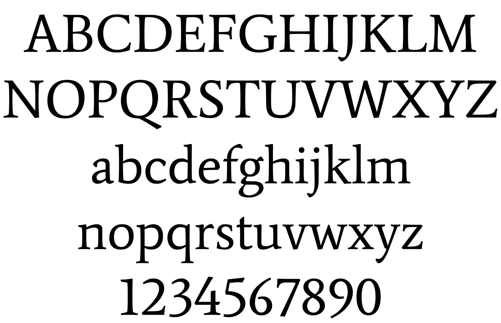
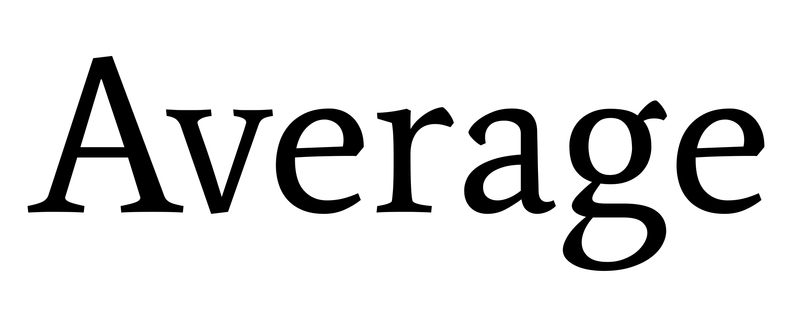

Average is a typeface that emerged from a long process of research into text typeface families from various different historical periods, both classical and contemporary. The idea was to design an average font for use in text, through a lengthy process of shape measurement and data gathering in spreadsheets. This resulted in a series of parameters which could be used by a designer to determine the proportions, color, spacing and other attributes of a typeface. Once the parameters were defined and best values were selected, the forms for the Average Regular typeface were drawn.

A sans sister family, Average Sans, is also available.
